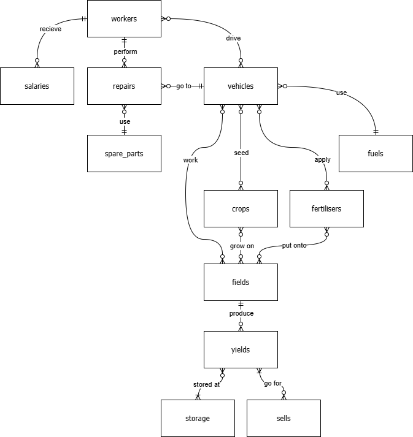

# Small Farming Database Design

## Scope

This database, designed for CS50 SQL, includes the necessary entities to track workers, machinery, fields, seeds, fertilisers, and yields within a small farming enterprise. As such, the database scope includes:

* Employees, basic identifying information about employees.
* Salaries, annual compensation records for personel.
* Vehicles, various types of machinery owned by the farm, including their purchase/sale dates and prices.
* Fuel, types with available quantity and price.
* Fields, names and sizes of fields managed by the farm, along with their purchase/sale dates and prices.
* Crops, types of seeds, including their names, quantities and prices.
* Fertilisers, types of fertilisers, including their names, amounts and prices.
* Repairs, records indicating the time period during which a specific vehicle was under repair, including the spare parts used.
* Spare Parts, types of spare parts used in repairs, including their names, quantities and costs.
* Yields, records of the amount of produce generated by a specific field in a given year.
* Storages, storage units with capacity and acquisition cost.
* Sells, records of yield sales with quantity and price

Out of scope is information about the cash flow and farm's balance

## Functional Requirements

This database will support:

* CRUD operations on all the entities.
* Tracking which workers operated which machines on which fields on a given date.
* Viewing current farm assets.

## Representation

### Entities

The database include the following entities:

#### Employees

The `employyes` table includes:

* `id`, which specifies a unique identifier for the worker as an `INTEGER`. The `PRIMARY KEY` constraint is applied to this column,
* `first_name`, which specifies the worker's first name as `TEXT`, because `TEXT` is appropriate to store information in name fields. `NOT NULL` constraint ensures that this field is not empty.
* `last_name`, whisch specifies the worker's last name as `TEXT` with `NOT NULL` constraint applied for the same reason,
* `occupation`, which specifies the worker's occupation as `TEXT` with `NOT NULL` constraint ensures that each employee has a defined role,
* `hired_date`, which specifies the date of hiring as `NUMERIC`. `CURRENT_DATE` is used by default. The `NOT NULL` constraint ensures that hiring records are always present,
* `terminated_date`, which specifiess the date of the employee being dismissed or terminated as `NUMERIC`. A default value is `NULL`, indicating that the worker is still employed.

#### Salaries

The `salaries` table includes:

* `id`, which specifies a unique identifier for the salary record as an `INTEGER`. `PRIMARY KEY` is applied,
* `employee_id`, which represents ID of the worker recieved this salary, stored as an `INTEGER`. `FOREIG KEY` is applied to ensure data integrity with `employees` table via the `id` column,
* `amount`, which specifies the employee annual salary in euros (without cents), stored as an `INTEGER`. The `NOT NULL` constraint ensures that the employed worker recieved his stipend,
* `year`, which specififes the year of the salary record as an `INTEGER`. The `NOT NULL` constraint ensures that each record is associated with a specific year.

#### Vehicles

The `vehicles` table includes:

* `id`, which specifies unique identifier of the vehicle owned, stored as an `INTEGER` with `PRIMARY KEY` constraint applied,
* `model`, which specifies the full name of the vehicle as `TEXT`. The `NOT NULL` constraint ensures that each vehicle has a defined model name,
* `type`, which specifies the type of the machinery as `TEXT` with `NOT NULL` constraint applied,
* `purchase_price`, which specifies the amount of money (euros without cents) paid to aquire the vehicle, stored as am `INTEGER`. The `NOT NULL` constraint ensures that the purchased value is always recorded,
* `purchase_date`, which spicifies the date the vehicle being purchased as `NUMERIC` with `NOT NULL` constraint constraint ensures that each vehicle has a recorded acquisition date,
* `disposal_price`, which specifies the amount of money (euros without cents) recived after selling the vehicle, stored as an `INTEGER`. By default `NULL` is used to show that the mechinery is still in use.
* `sell_date`, which specifies the date the vehicle being sold as `NUMBERIC`. `NULL` is applied by default for the same reason.

#### Fuel

The `fuel` table includes:

* `id`, which specifies the unique fuel identifier, stored as an `INTEGER` with the `PRIMARY KEY` constraint applied.
* `type`, which specifies the fuel type, stored as `TEXT`. A `CHECK` constraint is applied to ensure that the value is one of the fuel types used by the farm.
* `amount`, which specifies the available amount of fuel as an `INTEGER`. A `CHECK` constraint ensures that the amount is always greater than or equal to zero.
* `unit_price`, which specifies the cost per litre of a specific fuel in euros (without cents), stored as an `INTEGER`.
All columns in the `fuel` table are required and therefore have the `NOT NULL` constraint applied.

#### Repairs

The `repairs` table includes:

* `id`, which specifies unique identifier of the repair as an `INTEGER`. The `PRIMARY KEY` constraint is applied,
* `vehicle_id`, which represents the vehicle being undergoing repair as an `INTEGER`. The `FOREIGN KEY` constraint is applied to ensure data integrity with `vehicles` table via `id` column,
* `parts_kit_id`, which represents the kit of parts being used in the repair as an `INTEGER`. The `FOREIGN KEY` constraint is applied to ensure data integrity.
* `start_date`, which specifies the date and time when the repair began as `NUMERIC`. The `NOT NULL` constraint ensures each repir has record start date,
* `end_date`, which specifies the date and time of the end of the repair as `NUMERIC`. By default NULL value is set in order to show that the repair is still running.

#### Fields

The `fields` table includes:

* `id`, which specifies unique identifier of the field as an `INTEGER`. Thus `PRIMARY KEY` constraint is applied,
* `name`, which specifies the name of the field as `TEXT` with `NOT NULL` AND `UNIQUE` constraints that ensure that each field record is not empty and has a defined name,
* `area`, which specifies the size of the field in sqared meteres as `INTEGER`, The `NOT NULL` constraint ensures that the field size is always recorded,
* `purchase_price`, which specifies the amount of money paid to purchase the field, expressed in euros (without cents) as an `INTEGER`. The `NOT NULL` ensures that the purchase value is always recorded,
* `purchase_date`, which spicifies the date the field being purchased as a `NUMERIC` with `NOT NULL` constraint constraint ensures that each field has a recorded acquisition date,
* `disposal_price`, which specifies the amount of money (euros without cents) recived after selling the field, stored as an `INTEGER`. By default `NULL` is used to show that the field is still in use.
* `sell_date`, which specifies the date the field being sold as a `NUMBERIC` By default `NULL` is used to show that the land is still in use.

#### Crops

The `crops` table includes:

* `id`, which specifies unique identifier of the crop as an `INTEGER` with `PRIMARY KEY` constraint applied,
* `name`, which specifies the name of the crop as `TEXT`,
* `type`, which specifies the type of the crop as `TEXT`. `CHECK` constraint ensures that value is one of the crops seeded by the farm,
* `amount`, which specifies the available quantity of specific crop in kilograms as `INTEGER`,
* `unit_price`, which specifies the price per kilogram for a specific crop as `INTEGER`.
All columns in the `crops` table are required and hence should have the `NOT NULL` constraint applied.

#### Fertilisers

The `fertilisers` table includes:

* `id`, which specifies unique fertiliser identifier as an `INTEGER` with `PRIMARY KEY` constraint applied,
* `name`, which specifies the name of the fertiliser as `TEXT`,
* `type`, which specifies the type of the fertiliser as `TEXT`. `CHECK` constraint ensures that value is one of the fertilisers applied by the farm,
* `amount`, which specifies the available quantity of specific fertiliser in kilograms as `INTEGER`,
* `unit_price`, which fies the price per kilo for a specific fertiliser as `INTEGER`.
All columns in the `fertilisers` table are required and hence should have the `NOT NULL` constraint applied.

#### Yields

The `yields` table includes:

* `id`, which specifies unique identifier for each yield collection as an `INTEGER`. The `PRIMARY KEY` constraint is applied,
* `shift_id`, which represents the identifier of the shift collected the yield as `INTEGER` with `FOREIGN KEY` constraint applied to ensure the data integrity with `shifts` table via `id` column,
* `quantity`, which specifies collacted yiled quantity, epressed in kilograms as an `INTEGER`,
* `year`, which specifies the year of the yield being collected as an `INTEGER`,
All columns in the `yields` table are required and hence should have the `NOT NULL` constraint applied.

Apart from main entities, the database include several join-tables that ensures data integrity:

#### Fuel Used

The `fuel_used` table includes:

* `id`, which specifies the unique identifier of the vehicle refuelling operation as an `INTEGER` with the `PRIMARY KEY` constraint applied,
* `vehicle_id`, which specifies the identifier of the vehicle being refuelled as an `INTEGER`. The `FOREIGN KEY` constraint is applied to ensure data integrity with the `vehicles` table via the `id` column,
* `fuel_id`, which specifies the identifier of the fuel type used during the refuelling as an `INTEGER`. The `FOREIGN KEY` constraint is applied to ensure data integrity with the `fuel` table via the `id` column,
* `amount`, which specifies the quantity of fuel added to the vehicle, expressed in litres as an `INTEGER`. The `NOT NULL` constraint ensures that the refuel quantity is always recorded,
* `date`, which specifies the date and time of the refuelling operation as `NUMERIC`. The default value is `CURRENT_TIMESTAMP`, indicating when the refuelling entry was created.

#### Shifts

The `shifts` table includes:

* `id`, which specifies the unique shift identifier as an `INTEGER` with the `PRIMARY KEY` constraint applied,
* `field_id`, which specifies the identifier of the field on which the work is performed as an `INTEGER`. The `FOREIGN KEY` constraint ensures data integrity with the `fields` table via the `id` column,
* `vehicle_id`, which specifies the identifier of the vehicle used during the shift as an `INTEGER`. The `FOREIGN KEY` constraint ensures data integrity with the `vehicles` table via the `id` column,
* `employee_id`, which specifies the identifier of the employee who performed the work as an `INTEGER`. The `FOREIGN KEY` constraint ensures data integrity with the `employees` table via the `id` column,
* `work_type`, which specifies the type of work performed during the shift as `TEXT`. The `NOT NULL` constraint ensures that each shift has a defined work category,
* `date`, which specifies the date of the shift as `NUMERIC` with `NOT NULL` costraint applied. The default value is `CURRENT_DATE`, indicating the date when the shift record was created.

#### Seeded Crops

The `seeded_crops` table includes:

* `id`, which specifies the unique identifier of a seeding operation as an `INTEGER` with the `PRIMARY KEY` constraint applied,
* `crop_id`, which specifies the identifier of the crop being seeded during this operation as an `INTEGER`. The `FOREIGN KEY` constraint ensures data integrity with the `crops` table via the `id` column,
* `shift_id`, which specifies the identifier of the shift during which the seeding occurred as an `INTEGER`. The `FOREIGN KEY` constraint ensures data integrity with the `shifts` table via the `id` column,
* `quantity`, which specifies the quantity of seeds used, expressed in kilograms as an `INTEGER`. The `NOT NULL` constraint ensures that the seeded amount is always recorded.

#### Fertiliser Applied

The `fertilisers_applied` table includes:

* `id`, which specifies the unique identifier of a fertilising operation as an `INTEGER` with the `PRIMARY KEY` constraint applied,
* `fertiliser_id`, which specifies the identifier of the fertiliser applied during this operation as an `INTEGER`. The `FOREIGN KEY` constraint ensures data integrity with the `fertilisers` table via the `id` column,
* `shift_id`, which specifies the identifier of the shift during which the fertiliser was applied as an `INTEGER`. The `FOREIGN KEY` constraint ensures data integrity with the `shifts` table via the `id` column,
* `amount`, which specifies the amount of fertiliser applied, expressed in kilograms as an `INTEGER`. The `NOT NULL` constraint ensures that the applied amount is always present.

#### Parts Kit

The `parts_kit` table includes:

* `id`, which specifies the unique identifier of the parts‑usage record as an `INTEGER` with the `PRIMARY KEY` constraint applied,
* `repair_id`, which specifies the identifier of the repair operation in which the parts were used as an `INTEGER`. The `FOREIGN KEY` constraint ensures data integrity with the `repairs` table via the `id` column,
* `part_id`, which specifies the identifier of the spare part used during the repair as an `INTEGER`. The `FOREIGN KEY` constraint ensures data integrity with the `spare_parts` table via the `id` column,
* `quantity`, which specifies the number of units of the spare part used, expressed as an `INTEGER`. The `NOT NULL` constraint ensures that the consumed quantity is always recorded.

#### Yields Stored

The `yields_stored` table includes:

* `id`, which specifies the unique identifier of the storage operation as an `INTEGER` with the `PRIMARY KEY` constraint applied,
* `yield_id`, which specifies the identifier of the yield being stored as an `INTEGER`. The `FOREIGN KEY` constraint ensures data integrity with the `yields` table via the `id` column,
* `storage_id`, which specifies the identifier of the storage unit in which the yield is placed as an `INTEGER`. The `FOREIGN KEY` constraint ensures data integrity with the `storages` table via the `id` column,
* `quantity`, which specifies the amount of yield stored, expressed in kilograms as an `INTEGER`. The `NOT NULL` constraint ensures that the stored quantity is always present.

### Relationships

The below entity-relationship diagram represents the relationships among the entities in the database.

As described by the diagram:

* One employee may receive no salary (e.g., during their first year of employment), one or multiple annual salary records if employed for more than one year. Each salary record belongs to one and only one employee.
* One employee may drive zero (if their occupation does not involve operating vehicles), one, or multiple vehicles. A vehicle may be driven by zero (e.g., newly acquired machinery), one, or many workers (implemented via `shifts` join-table).
* One employee may be involved in zero, one, or multiple repairs. Each repair is performed by exactly one worker (implemented via `shifts` join-table).
* One repair uses one or multiple spare parts. A spare part may be used in multiple repairs (implemented via `parts_kit` join-table).
* One vehicle may use only one fuel type, while one fuel type might be used by zero, one or multiple vehicles (implemented via `fuel_used` join-table).
* One vehicle may operate on zero, one, or multiple fields. Likewise, one field may be worked by zero, one, or many vehicles (implemented via `shifts` join-table).
* One vehicle may be used to seed zero, one, or multiple crops. Each crop is seeded by zero, one or multiple vehicles (implemented via `seeded_crops` and `shifts` join-tables).
* The same relationship applies to fertilisers (implemented via `fertilisers_applied` and `shifts` join-tables).
* One field may produce zero, one, or multiple yields. Each yield is produced by exactly one field.
* One yield may be stored in one or multuple storage units. A storage building may contain zero, one, or multiple yield collections (implemented via `yields_stored` join-table).
* One yiled may be sold zero, one or multiple times (if divided). A single sales record may represent one or multiple yields sold.

## Optimizations

To ensure proper representation of the enterprise’s current assets and to speed up retrieval of frequently queried information, the following views are used:
* `current_personnel`, which provides a view of the workers currently employed by the farm.
* `available_vehicles`, which represents the vehicles currently owned by the farm.
* `managed_fields`, which represents the fields currently owned or in use by the farm.
* `storage_occupancy`, which shows the current occupancy level of each storage unit.
* `assets`, which calculates the total value of assets across the categories: `vehicles`, `fuel`, `fields`, `crops`, `fertilisers`, `spare_parts` and `storages`.

To speed up data updates and ensure data integrity between tables, the following triggers are implemented:
* `after_refuel_fuel_update`, which automatically subtracts the amount of fuel used for refuel from the total available amount of that fuel.
* `after_seeded_crops_update`, which automatically subtracts the quantity of seeds sown from the total available amount of that crop.
* `after_applied_fertilisers_update`, which automatically subtracts the quantity of fertilisers used from the total available amount of that fertiliser.
* `after_usage_parts_update`, which automatically subtracts the quantity of parts used from the total available quantity of those parts.
* `yields_stored_insert_check`, which verifies that the selected storage unit has sufficient free capacity to hold the specified quantity of yield.
* `after_sell_storage_update`, which automatically subtracts the quantity of sold yield from the available quantity of that yield type stored in the corresponding storage units.

To speed up searches, indexes are created on the `vehicles`.`model`, `fields`.`name`, and `shifts`.`date` columns.

## Limitations

The current schema assumes that all numeric values (numbers) are stored as integers, which prevents representing fractional quantities unless values are rounded up, stored in smaller units (such as cents instead of euros), or the data type is changed to `REAL`. In addition, the schema does not support recording purchase history for fuel, crops, or fertilisers, nor does it provide mechanisms for tracking cash flow or representing the farm’s financial balance-functionality that would require additional tables, views, and triggers.

